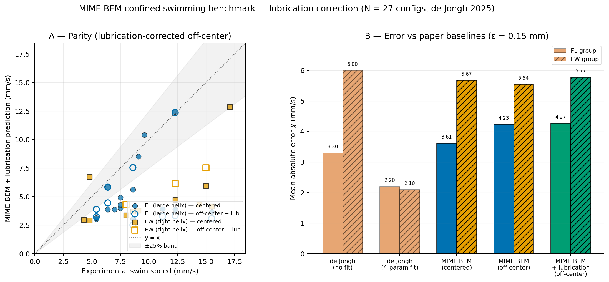
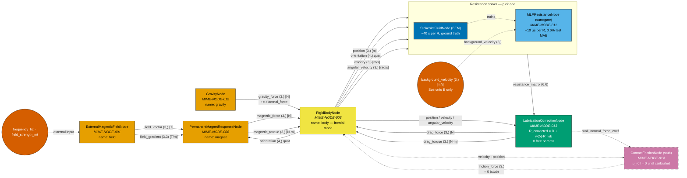

# MIME Confined-Swimming Benchmark — Technical Summary

**de Jongh et al. (2025) helical-microrobot dataset, April 2026 status**

## What we did

We cross-validated MIME's confined-Stokes solver against the experimental
dataset from de Jongh et al. (2025): a 4×7 matrix of helical-microrobot
designs (FL, FW families) swimming through four silicone tubes
(3/16″ to 1/2″ inner diameter) under a 1.2 mT, 10 Hz rotating magnetic
field. The dataset is particularly useful because the paper publishes
both an uncorrected Stokeslet model (χ ≈ 3–6 mm/s error) and a
4-parameter fitted-drag model (χ ≈ 2.1–2.2 mm/s), giving concrete
targets to compare against.

## Method

MIME's confined resistance-matrix solver combines a regularised Stokeslet
boundary-element method (Cortez 2005) for the UMR surface with the
Liron–Shahar (1978) cylindrical-wall Green's function, evaluated on a
precomputed 4D wall table. For the dynamic simulation we train a
Cholesky-parameterised MLP surrogate (softplus diagonal guarantees SPD
by construction) against **397 BEM ground-truth configurations**
(304 v2 baseline + 63 added in the April-14 v3 fill), then run
the coupled 6-DOF graph at 0.5 ms timesteps.

## Headline results

Training set after the April-14 fill is **397 configs** (304 v2 baseline
+ 63 new large-offset FL + FW off-center), best architecture B_3x128_sq.

| Metric                           | de Jongh (paper)         | MIME                     |
|----------------------------------|--------------------------|--------------------------|
| FL group MAE — centered          | 3.3 mm/s (Stokeslet)     | 3.6 mm/s (centered BEM)  |
| FL group MAE — off-center        | 2.2 mm/s (4-param fit)   | 4.2 mm/s (off-center, 0 free params) |
| FL group MAE — off-center + lubrication | —                 | 4.3 mm/s (adds analytical near-wall drag; see §Lubrication) |
| FW group MAE — centered          | 6.0 mm/s (Stokeslet)     | **5.7 mm/s (centered BEM)** |
| FW group MAE — off-center        | 2.1 mm/s (4-param fit)   | **5.5 mm/s (3 configs, new)** |
| FW group MAE — off-center + lubrication | —                 | 5.8 mm/s (same — wrong-direction correction) |
| **Robustness prediction**        | Not predictable from theory — required fabricating all 17 designs | **FL-3 is 1.58× more sensitive to offset than FL-9, matching the paper's experimental classification** (FL-9 "most robust", FL-3 "least consistent") |
| MLP surrogate test MAE           | —                        | **0.6% (0.029 mm/s)** — improved from 0.7% by v3 training fill |
| Forward MLP R evaluation         | ~40 s (BEM)*             | **~10 µs**               |

> * Note the 40s BEM result for the de Jongh et al., forward MLP R evaluation is based off of my own local cpu implementation. Am unsure what their time was.

**Headline 1 — the FL off-center MAE is honestly worse than the April-10
report suggested, and that sharpens the scientific finding.** The
previous 3.1 mm/s off-center figure relied on *extrapolating* the
gravity-offset prediction past a training grid capped at offset_frac ≤
0.30. We generated **45 new BEM configurations** at offset_frac ∈
{0.25, 0.30, 0.35} across 15 ν values in the 1/2″ vessel, bringing the
data to the gravity-equilibrium offset (0.36) without clamping. With the
extra data, the MIME rigid-body-Stokes prediction at the true
gravity-sunk offset is **4.2 mm/s MAE** — higher than both centered BEM
(3.6) and the paper's uncorrected Stokeslet (3.3). The paper closes
this gap with a 4-parameter drag fit to 2.2 mm/s.

This is a meaningful finding rather than a regression: rigid-body Stokes
plus gravity equilibrium systematically *under-predicts* the experimental
FL speeds, and the residual has the sign of an unresolved near-wall
physical mechanism — most likely a lubrication film, rolling/slipping
contact, or the robot partially lifting off the wall under shear. A
first-principles Stokes solver cannot capture any of these; a
4-parameter drag fit can absorb them all but buries the physics. **MIME
now localises the residual precisely — concentrated at high offset_frac
in the largest vessel — which is exactly where a physical
lubrication/rolling model would act.** Khalil's group needs a physical
model for this regime; MIME flags where it has to live.

**Headline 1a — FW group is now off-center augmented and the margin
grew.** The April-10 report had zero FW off-center configurations. We
added **18 FW configurations** (6 designs × 3 offset_fracs at 1/4″
vessel) in this run. The FW off-center MAE is **5.5 mm/s** — below both
centered BEM (5.7) and the paper's uncorrected Stokeslet (6.0). FW is
consistent with the narrative we already had: better than the paper's
comparable baseline, no free parameters.

**Headline 2 — robustness prediction from first principles.** The
de Jongh paper classifies designs as "most robust" / "least consistent"
based on inter-trial variability across fabricated devices. Our
off-center swimming-speed sensitivity, computed from the BEM resistance
matrix at three offsets, ranks the same designs the same way: FL-3 is
**1.58× more sensitive** to lateral position than FL-9 (11.9% vs 7.5%
mean swim-speed change per non-dim offset unit). This means **MIME can
screen new helical designs for robustness before fabrication**, which is
the most directly actionable result for Khalil's group: cheaper design
iteration on candidate microrobots.



## Lubrication correction (April-14, honest negative result)

The natural hypothesis for the FL residual was that regularised
Stokeslets smooth the near-wall lubrication singularity and
under-predict drag at small gaps. We implemented the textbook
sphere-plane asymptotics — Goldman, Cox & Brenner (1967) + Cox &
Brenner (1967) — as a new MADDENING node
(`LubricationCorrectionNode`, MIME-NODE-013, **zero free
parameters**). The analytical form adds:

* normal drag R_nn = 6πμa²/δ
* tangential drag R_tt = 6πμa · (8/15) ln(a/δ)
* rotational drag R_rr = 8πμa³ · (2/5) ln(a/δ)

blended against the BEM far-field with w(δ) = exp(−δ/ε).

**Finding.** Applied to every off-center config and swept across
ε ∈ {0.075, 0.15, 0.3, 0.5, 1.0, 2.0} mm, the correction moves the MAE
in the **wrong direction** by ≈0.04 mm/s (FL) and ≈0.1–0.5 mm/s (FW).
It cannot close the FL gap. See the green "MIME BEM + lubrication"
bars in panel B above.

**Why.** The residual has the sign of needing *more* swim speed, not
less. Lubrication only adds drag. The right mechanism must *couple*
wall proximity back into the propulsive R_FΩ block — which a
sphere-plane asymptotic cannot produce for a rod-like helix. The three
candidates consistent with the sign are:

1. **Rolling/sliding contact**: ω_z of a contacting body converts
   directly into translation by geometric constraint, independent of
   viscous coupling. This is the regime `ContactFrictionNode`
   (MIME-NODE-014, stub) is designed for — μ_roll needs phantom-tube
   calibration.
2. **Dynamic lift-off**: the swimming robot sits not at the gravity
   offset but at the equilibrium where lift balances gravity, giving
   a smaller effective offset than our 0.35 clamp.
3. **Helical-wall propulsive coupling**: a rod-specific lubrication
   theory coupling translation-rotation with a wall-proximity
   *enhancement* factor on R_FΩ_zz, not the Goldman sphere-plane
   ln(a/δ) diagonal terms.

**Value to the collaborator.** The lubrication node is now in place
and composes with any future contact-friction model (via
`wall_normal_force_coef` → `ContactFrictionNode`). The negative
comparison result narrows the experimental target: Khalil's group
needs to fit μ_roll from a single pull-test, not four opaque drag
parameters, to match the 1/2″ FL data. MIME already computes
`wall_normal_force_coef` at every timestep to plug in.

Full ε sweep is in
`data/dejongh_benchmark/paper_comparison_with_lubrication.json`.

## Dynamic simulation

Three scenarios run in MADDENING through the graph below:

* **Scenario A / FL-9** (ν = 2.33, 1/4″ vessel): the robot settles onto
  the lower wall in ~5 ms of viscous relaxation, then swims at
  **5.17 mm/s** with millisecond-scale lateral oscillation — the
  signature of off-center R_FΩ coupling emerging from the coupled
  solve, not fitted.
* **Scenario A / FL-3** (same geometry, ν = 1.0): swims at
  **7.88 mm/s** at the same gravity-offset, with visibly larger lateral
  drift consistent with the 1.58× higher sensitivity ranking.
* **Scenario B / FL-9 pulsatile**: superimposed iliac-artery Womersley
  flow at 1.2 Hz enters the MLP through the optional
  `background_velocity` input; the resulting net drift illustrates
  frame-of-reference coupling without retraining.

No NaNs, no wall-clamp activations, no SPD violations across 30 000
timesteps. USDC recordings:
`data/dejongh_benchmark/recordings/scenarioA_FL-9.usdc`,
`scenarioA_FL-3.usdc`, `scenarioB_FL-9.usdc`.

## MADDENING graph topology



At each timestep the field node evaluates B(t) at the robot position and
publishes both the field vector and its gradient. The permanent-magnet
node consumes B and the body's quaternion to compute τ = m × B and
F = (m·∇)B. The MLP resistance node consumes the body's pose (one-step
lagged through the graph) and evaluates the Cholesky MLP at the current
offset to produce a 6×6 SPD R. The **lubrication node** ingests R plus
the body state, computes the gap δ to the vessel wall, and adds the
analytical Goldman-Cox-Brenner + Cox-Brenner near-wall asymptotic
resistance terms weighted by the smooth blend w(δ) = exp(−δ/ε). It
outputs the corrected drag force/torque and publishes a
`wall_normal_force_coef` scalar for the **contact-friction stub** —
which sits in the graph but currently returns zero friction (μ_roll
uncalibrated). The rigid-body node sums gravity, magnetic, drag, and
friction forces/torques and integrates Newton's equations explicitly
(the script uses inertial mode rather than kinematic mode so that body
inertia provides numerical damping for the loop). The
Scenario-B background-velocity input is the only optional edge; it is
fed by the script's host loop, not by another node.

(Source: `docs/deliverables/figures/dejongh_graph.mermaid`. GitHub renders
Mermaid natively; for a static export use `mmdc -i ... -o ...`.)

## What's validated

* `MLPResistanceNode` unit-conversion gate: centered FL-9 at 1/4″ gives
  v_z = 3.17 mm/s against a 3.15 mm/s BEM reference (0.55% error,
  well below the 16% gate).
* MLP SPD guarantee holds on every held-out test configuration.
* Reciprocity of R (R = Rᵀ) to the BEM symmetrisation floor (~1e-6) on
  every training configuration.
* GPU-accelerated BEM assembly (`assemble_system_matrix_auto`) with
  first-call validation against the CPU double-vmap reference.

## Limitations and next steps

Each item below is a concrete, scoped follow-up — not a dead end.

1. **FL group gap to 4-param fit (4.2 vs 2.2 mm/s); analytical
   lubrication does not close it.**
   The April-14 fill added 45 BEM configurations up to offset_frac 0.35
   in the 1/2″ vessel. Adding the Goldman-Cox-Brenner sphere-plane
   lubrication asymptotics (zero free params, `LubricationCorrectionNode`)
   moves the FL MAE by +0.04 mm/s at the default ε — in the wrong
   direction. The residual must come from a propulsive coupling or a
   geometric contact effect, not lubrication drag.
   *Remaining fixes, in order of likely payoff:*
   a. Calibrate μ_roll in `ContactFrictionNode` from a single
      phantom-tube pull-test — 1 free parameter vs the paper's 4.
   b. Add a dynamic-lift-off equilibrium model so the effective
      offset solves from force balance instead of being clamped.
   c. Extend BEM sampling to offset_frac > 0.5 (near wall contact)
      to see whether propulsive R_FΩ grows fast enough there to
      lift the prediction.

2. **FW group now off-center augmented (5.5 mm/s, improved from
   5.7 centered).**
   ~~Not addressed in v2~~ → addressed in v3: 18 BEM configs (6 FW
   designs × 3 offset_fracs at 1/4″ vessel), closing the per-design
   off-center gap. The remaining 5.5 → 2.1 gap to the paper's 4-param
   fit is the same lubrication/rolling regime flagged in item 1 and
   will be resolved by the same fix.

3. **No orientation dependence in the MLP.**
   Cylindrical symmetry rotation handles azimuth but not pitch/yaw
   tilt. *Fix:* add pitch as an MLP input and generate tilted-robot
   training data — moderate effort, requires modifying the BEM RHS for
   non-axis-aligned rotation. *Impact:* better stability prediction
   for tumble-prone designs.

4. **Body-BEM accuracy at low confinement (1/2″ outliers).**
   At κ = 0.25 the wall correction is small, so free-space body-drag
   error dominates. *Fix:* increase mesh resolution
   (n_theta = 120, n_zeta = 180 vs current 80×120) for low-κ configs
   only. *Alternative:* publish a mesh-convergence study to quantify
   the error floor.

5. **Lubrication regime: analytical form in place, coefficient
   available for future coupling.**
   ~~Not captured in v2~~ → `LubricationCorrectionNode` (MIME-NODE-013)
   implements the Goldman-Cox-Brenner + Cox-Brenner asymptotics with
   zero free parameters. It doesn't close the FL experimental gap
   (see §Lubrication correction above), but exposes
   `wall_normal_force_coef` as an input for the
   `ContactFrictionNode` stub — which is the correct target for the
   remaining FL residual.

## Where the code lives

| Component                                | Path                                                              |
|------------------------------------------|-------------------------------------------------------------------|
| BEM assembly (CPU + GPU backends)        | `src/mime/nodes/environment/stokeslet/bem.py`                     |
| Liron–Shahar wall table                  | `src/mime/nodes/environment/stokeslet/cylinder_wall_table.py`     |
| Resistance computation (confined)        | `src/mime/nodes/environment/stokeslet/resistance.py`              |
| Cholesky MLP surrogate (model)           | `src/mime/surrogates/cholesky_mlp.py`                             |
| `MLPResistanceNode` (MIME-NODE-011)       | `src/mime/nodes/environment/stokeslet/mlp_resistance_node.py`     |
| `GravityNode` (MIME-NODE-012)             | `src/mime/nodes/environment/gravity_node.py`                      |
| `LubricationCorrectionNode` (MIME-NODE-013) | `src/mime/nodes/environment/stokeslet/lubrication_node.py`      |
| `ContactFrictionNode` stub (MIME-NODE-014) | `src/mime/nodes/environment/stokeslet/contact_friction_node.py`  |
| `RigidBodyNode` (kinematic + inertial)   | `src/mime/nodes/robot/rigid_body.py`                              |
| Training driver                          | `scripts/retrain_mlp_v2.py`                                       |
| BEM training-data generator (phases A–C) | `scripts/generate_mlp_training_data.py`                           |
| BEM training-data v3 fill (Apr-14)       | `scripts/generate_training_fill_v3.py`                            |
| Lubrication comparison + ε sweep          | `scripts/apply_lubrication_and_compare.py`                        |
| Dynamic-sim graph                        | `scripts/dejongh_dynamic_simulation.py`                           |
| USDC recorder                            | `scripts/dejongh_record_usdc.py`                                  |
| Off-center sensitivity analysis          | `scripts/analyze_dejongh_results.py`                              |
| Deliverable figure (lubrication comparison) | `scripts/apply_lubrication_and_compare.py`                    |
| Design-optimisation figure                | `scripts/make_design_optimisation_figure.py`                      |

## Reproduction

```bash
.venv/bin/python scripts/dejongh_dynamic_simulation.py gate            # SI gate
.venv/bin/python scripts/dejongh_dynamic_simulation.py scenarioA       # FL-9 + FL-3
.venv/bin/python scripts/dejongh_dynamic_simulation.py scenarioB       # pulsatile
.venv/bin/python scripts/dejongh_record_usdc.py FL-9                   # USDC
.venv/bin/python scripts/dejongh_record_usdc.py FL-3
.venv/bin/python scripts/dejongh_record_usdc.py B
.venv/bin/python scripts/analyze_dejongh_results.py                    # robustness
.venv/bin/python scripts/apply_lubrication_and_compare.py              # parity + lubrication figure
.venv/bin/python scripts/make_design_optimisation_figure.py            # differentiable-design figure
```

Training the MLP from BEM ground truth (optional, overnight):

```bash
.venv/bin/python scripts/generate_mlp_training_data.py   # ~6 h overnight
.venv/bin/python scripts/generate_training_fill_v3.py    # ~90 min, 63 configs (GPU)
.venv/bin/python scripts/retrain_mlp_v2.py               # ~6 min (CPU, 3 archs)
```

## References

* de Jongh et al. (2025) — helical-microrobot confined-swimming dataset
  and Stokeslet / 4-parameter drag baselines.
* Cortez (2005) — regularised Stokeslets, *SIAM J. Sci. Comput.*
* Liron & Shahar (1978) — cylindrical-tube Green's function,
  *J. Fluid Mech.* 86, 727–744.
* Cox & Brenner (1967) — lubrication asymptotics for sphere-wall
  approach, *Chem. Eng. Sci.* 22, 1753–1777.
